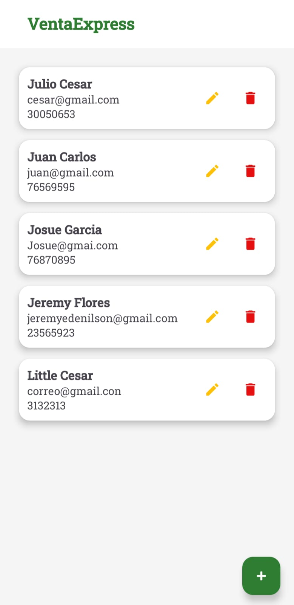
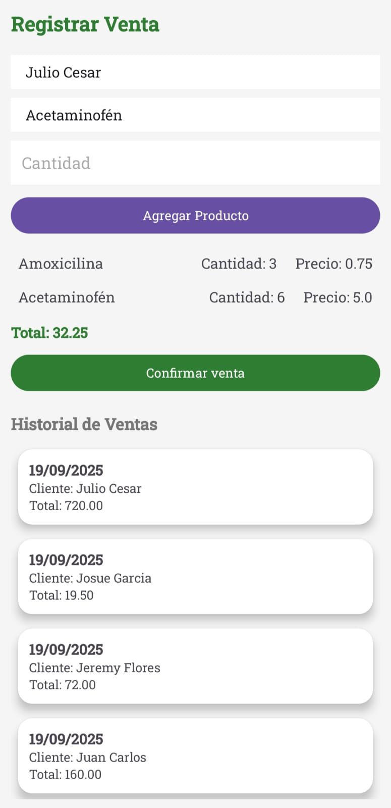

# 📱 VentaExpress

Sistema de ventas con tematica **medicamentos** desarrollado en **Android Studio con Kotlin**, como parte del **Segundo Desafío Práctico** de la materia *Desarrollo de Software para Móvil* en la **Universidad Don Bosco**.

---

## 🚀 Características principales
- **Autenticación con Firebase Authentication** (correo/contraseña, GitHub y Facebook).  
- **Gestión de productos**: agregar, editar, eliminar y listar con RecyclerView.  
- **Gestión de clientes**: registrar y administrar información básica.  
- **Registro de ventas**: seleccionar productos y clientes, calcular total y guardar historial.  
- **Base de datos en Firebase Realtime Database**, organizada por UID de cada empleado.  
- **Arquitectura MVC** para separar vistas, controladores y modelos.

---

## 🛠️ Tecnologías utilizadas
- **Lenguaje:** Kotlin  
- **IDE:** Android Studio  
- **Base de datos:** Firebase Realtime Database  
- **Autenticación:** Firebase Authentication  
- **UI:** RecyclerView, CardView, Material Design  

---

## 📸 Capturas de pantalla

  
  
  

  
  

---

## 🎥 Video demostrativo
👉 [Enlace al video de demostración](https://udbedu-my.sharepoint.com/:v:/g/personal/ge240098_alumno_udb_edu_sv/EYJzU3L3yuxPpoD7Seykyu0BqTsqS6jHZQastasF9KiiHQ?e=X4QoXj&nav=eyJyZWZlcnJhbEluZm8iOnsicmVmZXJyYWxBcHAiOiJTdHJlYW1XZWJBcHAiLCJyZWZlcnJhbFZpZXciOiJTaGFyZURpYWxvZy1MaW5rIiwicmVmZXJyYWxBcHBQbGF0Zm9ybSI6IldlYiIsInJlZmVycmFsTW9kZSI6InZpZXcifX0%3D)

---

## 👨‍💻 Integrantes
- Josué Eduardo García Estrada     | GE240098  
- Jeremy Edenilson Flores Portillo | FP240479  
- Edgar Josué Gómez Meléndez       | GM240279  

---

## 📌 Requisitos de instalación
1. Clonar este repositorio.  
2. Abrir el proyecto en Android Studio.  
3. Configurar Firebase Authentication y Realtime Database en el proyecto.  
4. Ejecutar en un dispositivo físico o emulador con API mínima requerida.
